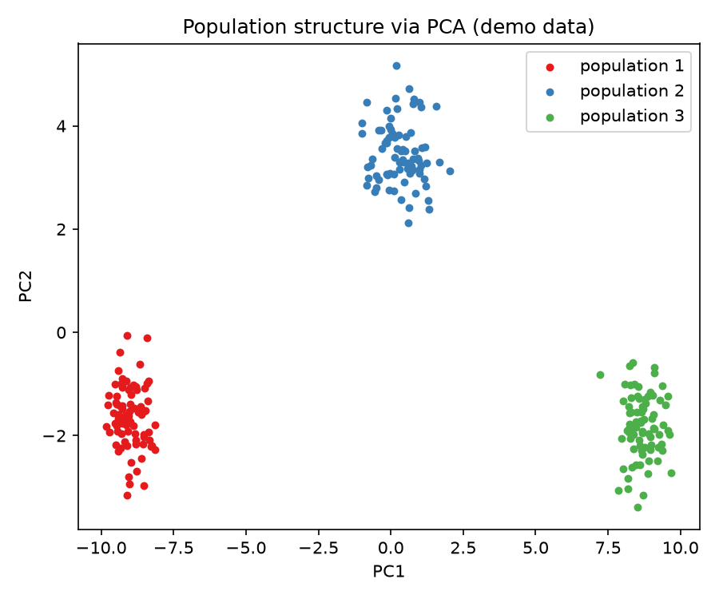

# Pca Population Structure

PCA of synthetic genotype data revealing population structure across three ancestral groups.

## Demo Output



The chart above is generated from simulated data by `demo.py` — run it yourself and it regenerates identically.

## Run It

```bash
pip install -r requirements.txt
python demo.py
```

## Note

This project demonstrates the technique on synthetic data so it is fully reproducible with no external downloads.
